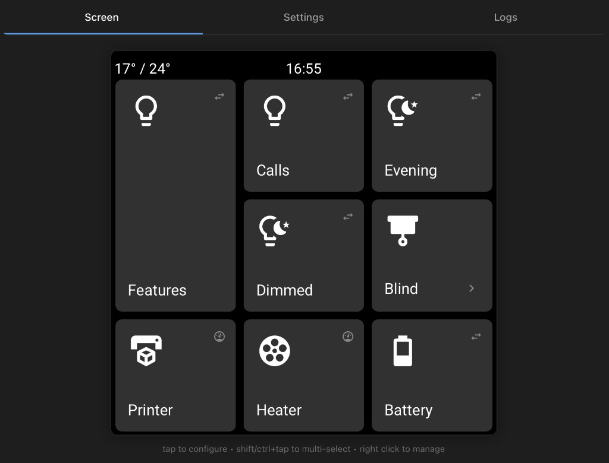

# EspControl

**A no-code, super-easy-to-configure smart home controller.** Configure affordable touchscreens to control devices across your entire smart home — no ESPHome setup, no YAML, no code to write. Just flash, connect, and start adding cards.

EspControl is free, open-source firmware that turns **Guition ESP32** touchscreens into beautiful control panels for [Home Assistant](https://www.home-assistant.io/). It comes with **full documentation** and an **easy-to-use web installer** — you can go from unboxing to a working wall panel in minutes.

Supported panels include the **10.1-inch JC8012P4A1** (1280×800, landscape, 20 card slots), the **7-inch JC1060P470** (1024×600, landscape, 15 card slots), the **4.3-inch JC4880P443** (480×800, portrait, 6 card slots), and the **4-inch 4848S040** (480×480, square, 9 card slots). Each panel uses a fixed grid layout sized to its screen, plus a status bar with a clock and temperatures, a screensaver, automatic brightness, and **over-the-air updates**. After the first install, everything is configured through the device's **built-in web page**.

**Documentation and install guide:** [jtenniswood.github.io/espcontrol](https://jtenniswood.github.io/espcontrol/)

## Features

- **Grid layout** — a fixed grid sized to each screen so you can place cards exactly where you want them
- **Subpages** — group related controls into folders to keep the home screen tidy
- **Flexible card sizes** — make cards Single, Tall, Wide, or Large to suit the control
- **Rich card types** — Switch, Action, Trigger, Sensor, Slider, Cover, Climate, Garage Door, Date, World Clock, Weather, and Weather Forecast
- **Edit controls** — drag-and-drop ordering, bulk select, and copy-paste between pages from the built-in web UI
- **Screensaver** — dims and sleeps after a set time, or wakes automatically from a presence sensor

## Supported Screens

| 10.1″ JC8012P4A1 | 7″ JC1060P470 | 4.3″ JC4880P443 | 4″ 4848S040 |
|:-:|:-:|:-:|:-:|
| Image pending |  |  |  |
| 1280×800 landscape · 20 card slots | 1024×600 landscape · 15 card slots | 480×800 portrait · 6 card slots | 480×480 square · 9 card slots |
| ESP32-P4 | ESP32-P4 | ESP32-P4 | ESP32-S3 |
| Guition / AliExpress | [AliExpress ~£40](https://s.click.aliexpress.com/e/_c335W0r5) | [AliExpress ~£24](https://s.click.aliexpress.com/e/_c32jr3eN) | [AliExpress ~£16](https://s.click.aliexpress.com/e/_c3sIhvBv) |
| | [Desk stand (3D print)](https://makerworld.com/en/models/2387421-guition-esp32p4-jc1060p470-7inch-screen-desk-mount#profileId-2614995) | | [Case stand (3D print)](https://makerworld.com/en/models/2581572-guition-esp32s3-4848s040-case-stand#profileId-2847301) |

See the [docs](https://jtenniswood.github.io/espcontrol/) for full specs and install instructions for each screen.

## Getting Started

1. **Buy a panel** (see above)
2. **Flash the firmware** from your browser — follow the [install guide](https://jtenniswood.github.io/espcontrol/getting-started/install)
3. **Connect to WiFi** using the on-screen setup
4. **Add to Home Assistant** — it will be discovered automatically
5. **Allow Home Assistant actions** — [enable the device](https://jtenniswood.github.io/espcontrol/getting-started/home-assistant-actions) to control your entities
6. **Configure your cards** by opening the panel's built-in web page

## Support This Project

If you find this project useful, consider buying me a coffee to support ongoing development!

## Links

- [Documentation](https://jtenniswood.github.io/espcontrol/)
- [Install guide](https://jtenniswood.github.io/espcontrol/getting-started/install)
- [FAQ](https://jtenniswood.github.io/espcontrol/reference/faq)
- [Report a bug or request a feature](https://github.com/jtenniswood/espcontrol/issues)
